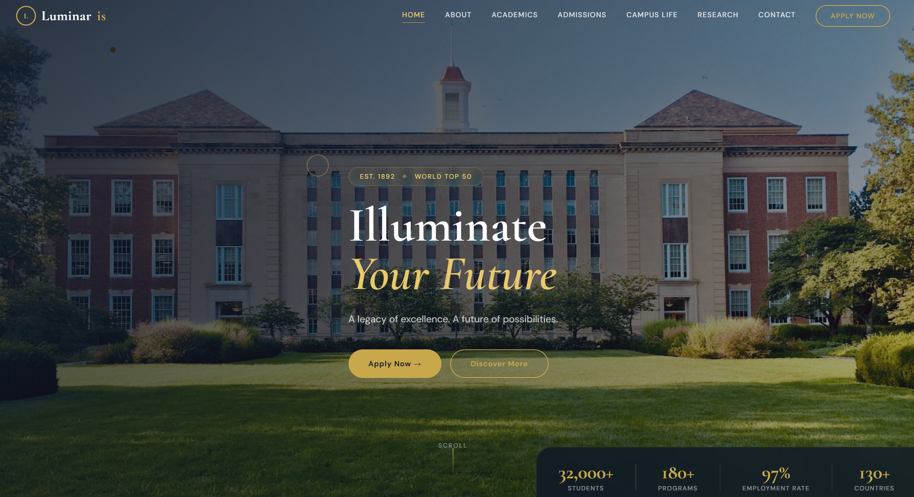
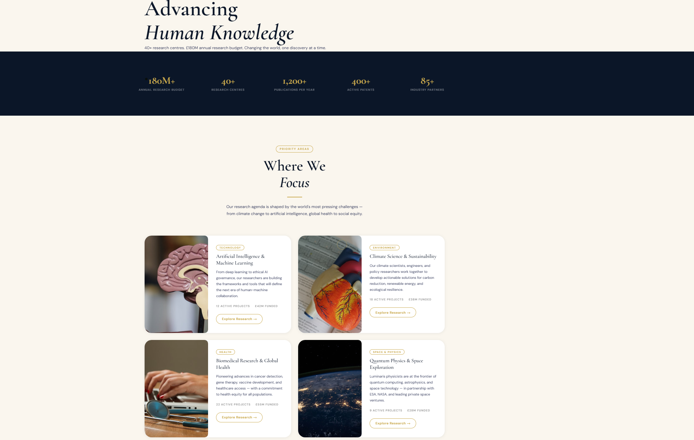
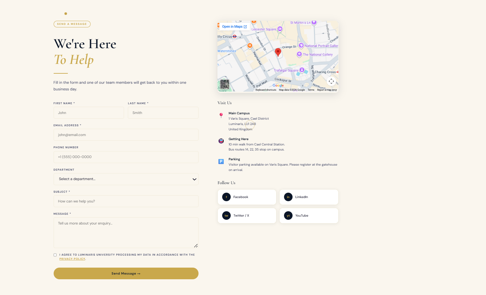
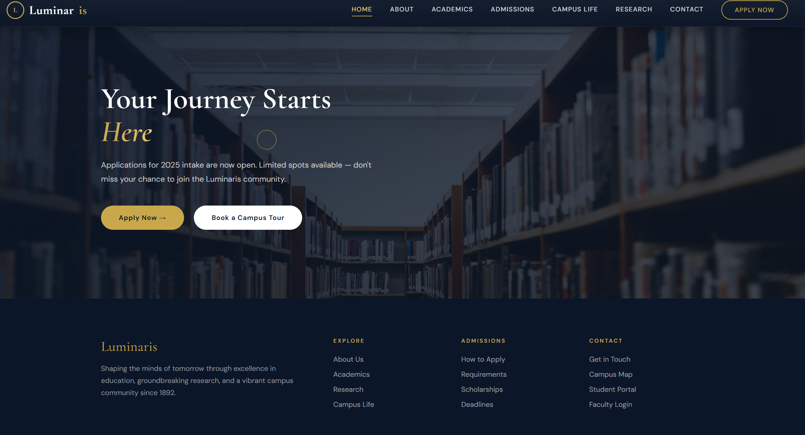

<div align="center">




### A Modern Full-Stack University Website

[](https://nodejs.org)
[](https://expressjs.com)
[](https://mongodb.com)
[](https://javascript.com)
[](https://html5.org)
[](https://css3.com)

*A beautifully designed, fully functional university website with a complete backend API, MongoDB database, JWT authentication, and Gmail email integration.*

[Live Demo](#) · [Docs](#documentation) · [ Quick Start](#quick-start) · [Features](#features)

</div>

---

##  Screenshots

<div align="center">

###  Home Page


<br/>

###  Research Page


<br/>

### Contact Page


<br/>

###  Contact Details & Form


</div>

---

## Features

### Frontend
- **7 Fully Designed Pages** — Home, About, Academics, Admissions, Campus Life, Research, Contact
- **Luxury Design System** — Navy `#0b1628` + Gold `#c9a84c` + Cream `#faf6ee`
- **Custom Cursor** — Gold dot + ring with smooth lag effect
- **Page Transitions** — Smooth navy overlay wipe between pages
- **Scroll Animations** — Reveal, parallax, counter animations
- **Typing Effect** — Cycling subtitle on hero section
- **3D Card Tilts** — Perspective tilt on news + faculty cards
- **Live Search** — Real-time program search on academics page
- **FAQ Accordion** — Smooth max-height animations
- **Fully Responsive** — Mobile, tablet, desktop
- **Glass Navbar** — Transparent → frosted glass on scroll

### Backend
- **REST API** — Full Express.js API with 20+ endpoints
- **JWT Authentication** — Secure token-based auth
- **Role-Based Access** — Student vs Admin routes
- **MongoDB** — 4 collections: users, news, applications, enquiries
- **Email System** — Beautiful HTML emails via Gmail SMTP
- **Auto References** — Application refs e.g. `LUM-2025-123456`
- **Auto Slugs** — SEO-friendly news article URLs
- **Input Validation** — Server-side validation on all routes
- **Password Hashing** — bcryptjs with salt rounds

---

## Project Structure
```
luminaris-university/
│
├── 📄 index.html               ← Home
├── 📄 about.html               ← About
├── 📄 academics.html           ← Programs & Faculties
├── 📄 admissions.html          ← Apply
├── 📄 campus-life.html         ← Student Life
├── 📄 research.html            ← Research
├── 📄 contact.html             ← Contact
│
├── 📁 css/
│   ├── global.css              ← Design system & variables
│   ├── navbar.css              ← Navigation styles
│   ├── transitions.css         ← Animations & keyframes
│   └── pages/                  ← Page-specific styles (7 files)
│
├── 📁 js/
│   ├── main.js                 ← Shared: cursor, nav, footer, transitions
│   ├── animations.js           ← Scroll reveal, counters, parallax
│   └── pages/                  ← Page-specific JS (3 files)
│
├── 📁 demopics/                ← Demo screenshots
│
├── 📁 backend/
│   ├── server.js               ← Express entry point
│   ├── seed.js                 ← Database seeder
│   ├── .env                    ← Secrets (not committed)
│   ├── .env.example            ← Environment template
│   │
│   ├── 📁 config/
│   │   ├── db.js               ← MongoDB connection
│   │   └── nodemailer.js       ← Email transporter
│   │
│   ├── 📁 models/
│   │   ├── User.js             ← User schema + JWT + bcrypt
│   │   ├── Application.js      ← Admission application schema
│   │   ├── News.js             ← News article schema
│   │   └── Enquiry.js          ← Contact enquiry schema
│   │
│   ├── 📁 middleware/
│   │   ├── auth.js             ← JWT protection
│   │   └── adminOnly.js        ← Admin role guard
│   │
│   ├── 📁 controllers/
│   │   ├── authController.js
│   │   ├── applicationController.js
│   │   ├── newsController.js
│   │   └── contactController.js
│   │
│   └── 📁 routes/
│       ├── auth.js
│       ├── applications.js
│       ├── news.js
│       ├── contact.js
│       └── admin.js
│
├── 📄 .gitignore
├── 📄 README.md
├── 📄 FRONTEND_DOCS.md
└── 📄 backend/BACKEND_DOCS.md
```

---

## Quick Start

### Prerequisites
- [Node.js](https://nodejs.org) v18+
- [MongoDB](https://mongodb.com) v8+ (local) or [MongoDB Atlas](https://mongodb.com/atlas) (cloud)
- A Gmail account with [App Password](https://myaccount.google.com/apppasswords) enabled

### 1. Clone the repository
```bash
git clone https://github.com/yourusername/luminaris-university.git
cd luminaris-university
```

### 2. Install backend dependencies
```bash
cd backend
npm install
```

### 3. Set up environment variables
```bash
cp .env.example .env
```
Then fill in your values in `.env`:
```env
PORT=5000
MONGO_URI=mongodb://localhost:27017/luminaris
JWT_SECRET=your_super_secret_key
JWT_EXPIRE=7d
EMAIL_USER=your_gmail@gmail.com
EMAIL_PASS=your_16char_app_password
EMAIL_FROM=Luminaris University <your_gmail@gmail.com>
CLIENT_URL=http://127.0.0.1:5500
```

### 4. Seed the database
```bash
node seed.js
```
This creates:
- ✅ Admin account: `admin@luminaris.edu` / `Admin2025!`
- ✅ 3 sample news articles

### 5. Start the backend
```bash
node server.js
```
Server runs at: `http://localhost:5000`

### 6. Open the frontend
Open `index.html` with **Live Server** in VS Code
or simply open it in your browser.

---

## 🔌 API Endpoints

### Public Endpoints
| Method | Endpoint | Description |
|---|---|---|
| `GET` | `/api/news` | Get all published news |
| `GET` | `/api/news/:slug` | Get single article |
| `POST` | `/api/auth/register` | Register student account |
| `POST` | `/api/auth/login` | Login → returns JWT |
| `POST` | `/api/contact` | Submit contact enquiry |
| `POST` | `/api/applications` | Submit admission application |

### Protected Endpoints (JWT required)
| Method | Endpoint | Description |
|---|---|---|
| `GET` | `/api/auth/me` | Get current user |
| `PUT` | `/api/auth/me` | Update profile |
| `PUT` | `/api/auth/password` | Change password |

### Admin Only Endpoints
| Method | Endpoint | Description |
|---|---|---|
| `GET` | `/api/admin/stats` | Dashboard statistics |
| `GET` | `/api/admin/users` | All student accounts |
| `GET` | `/api/applications` | All applications |
| `PATCH` | `/api/applications/:id` | Approve / Reject |
| `DELETE` | `/api/applications/:id` | Delete application |
| `GET` | `/api/contact` | All enquiries |
| `PATCH` | `/api/contact/:id/read` | Mark as read |
| `POST` | `/api/news` | Create news article |
| `PUT` | `/api/news/:id` | Edit article |
| `DELETE` | `/api/news/:id` | Delete article |

---

## Design System

| Token | Value | Usage |
|---|---|---|
| `--navy` | `#0b1628` | Primary background |
| `--gold` | `#c9a84c` | Accent & CTAs |
| `--cream` | `#faf6ee` | Page background |
| `--gold-light` | `#e8c96e` | Hover states |
| Font Display | `Cormorant Garamond` | Headings & numbers |
| Font Body | `DM Sans` | Body text & UI |

---

## Database Collections

| Collection | Description |
|---|---|
| `users` | Student & admin accounts |
| `news` | Published news articles |
| `applications` | Admission applications |
| `enquiries` | Contact form submissions |

---

## Email System

Automated emails are sent for:
- ✅ New user registration → Welcome email
- ✅ Contact form submission → Admin notification + User confirmation
- ✅ Application submitted → Summary with reference number
- ✅ Application status update → Approval / Rejection notification

All emails use styled HTML templates matching the Luminaris brand.

---

## Tech Stack

| Layer | Technology |
|---|---|
| **Frontend** | HTML5, CSS3, Vanilla JavaScript |
| **Backend** | Node.js, Express.js |
| **Database** | MongoDB, Mongoose ODM |
| **Auth** | JSON Web Tokens, bcryptjs |
| **Email** | Nodemailer, Gmail SMTP |
| **Fonts** | Google Fonts (Cormorant Garamond, DM Sans) |
| **Images** | Unsplash (placeholder) |

---

## Default Admin Account
```
Email:    admin@luminaris.edu
Password: Admin2025!
Role:     admin
```
> Change these credentials before deploying to production!

---

## Documentation

- [Frontend Documentation](FRONTEND_DOCS.md) — Pages, components, JS architecture
- [Backend Documentation](backend/BACKEND_DOCS.md) — API, models, controllers

---

## Roadmap

- [ ] Admin Dashboard UI
- [ ] Student Portal
- [ ] File uploads (CV, transcripts)
- [ ] Online application form (full)
- [ ] Deploy to Render.com + MongoDB Atlas
- [ ] PWA support

---

## 📝License

This project is for educational purposes.
Feel free to use it as a template for your own university or institution website.

---

<div align="center">

Made late at night with a lot of coffee by **Sadik Aden Dirir**

⭐ Star this repo if you found it helpful!

</div>
